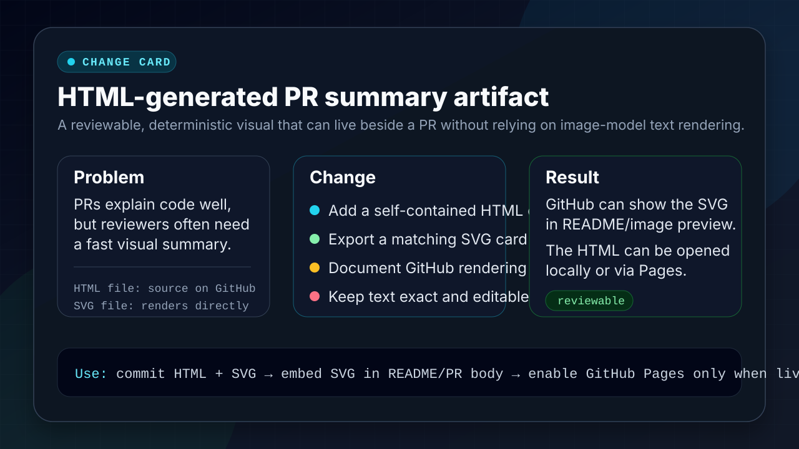

# HTML change card demo

This is a small demo artifact for summarizing PR work outside the PR text.

## GitHub rendering behavior

- `index.html`: GitHub repository file view shows the HTML source. It does not execute/render arbitrary HTML as a live page.
- `change-card.svg`: GitHub can render this directly as an image and it can be embedded in Markdown.
- Live HTML rendering needs GitHub Pages or another static host.

## Rendered SVG preview

## Intended workflow

1. Read a PR, branch, or commit range.
2. Generate a structured summary: problem, change, result, verification, risk.
3. Render the summary into `index.html` for local review.
4. Export or maintain `change-card.svg` / `change-card.png` for direct GitHub display.

This avoids the main weakness of AI-generated infographics: small text can drift or become unreadable. The card stays deterministic and editable.
